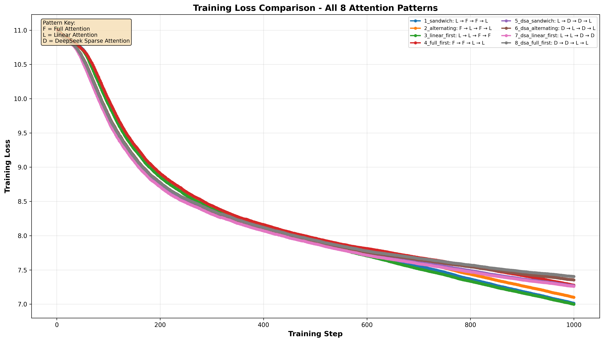
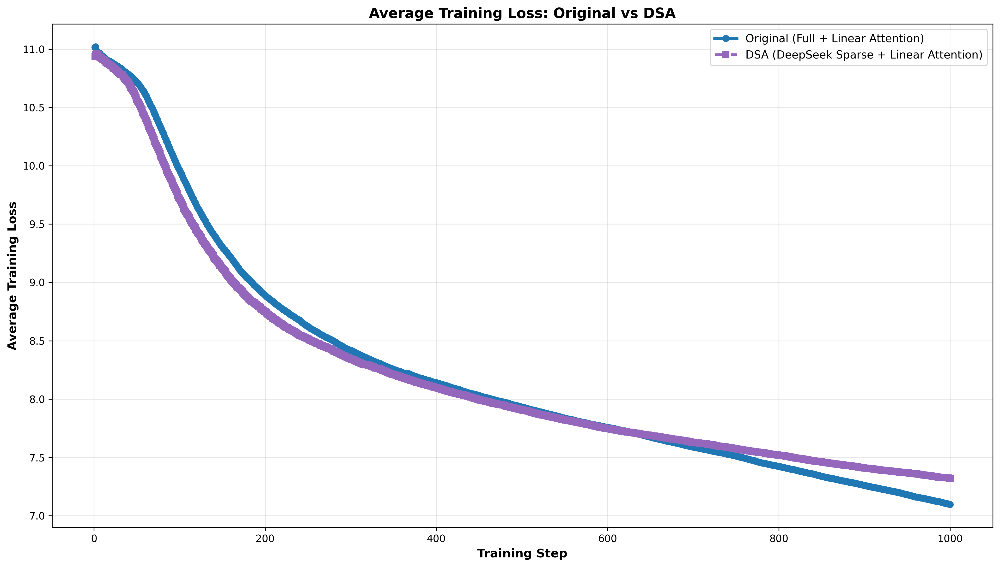

# DeepSeek Sparse Attention (DSA) + Gated DeltaNet (GDN) Hybrid Attention Variants

## Research Questions

1. Can replacing full attention with DeepSeek Sparse Attention (DSA) improve the efficiency and performance of a hybrid attention architecture that combines full attention and Gated DeltaNet (GDN)?

- Trains faster in the beginning, but full attention seems to surpass it with more training. Future work is to investigate this further.

2. Which combination of attention mechanisms across layers produces the best efficiency-performance tradeoff: (1) Full Attention + GDN, (2) DSA + GDN, (3) DSA only, or (4) Full Attention only?

- Currently L → F → F → L (Gated Deltanet → Full Attention → Full Attention → Gated Deltanet). Future work is to investigate this further.

#### All 8 Patterns Comparison


*Training loss curves for all 8 attention pattern variants. Solid lines represent Original patterns (Full + Linear Attention), dashed lines represent DSA patterns (DeepSeek Sparse + Linear Attention).*

#### Original vs DSA Average


*Average training loss curves comparing Original architectures vs DSA architectures.*

## Experiment Design

Compare 8 attention layer patterns across a 4-layer LLM architecture:

### Original Patterns (Full Attention + Linear Attention)
1. **Sandwich**: L → F → F → L
2. **Alternating**: F → L → F → L
3. **Linear First**: L → L → F → F
4. **Full First**: F → F → L → L

### DSA Patterns (DeepSeek Sparse Attention + Linear Attention)
5. **DSA Sandwich**: L → D → D → L
6. **DSA Alternating**: D → L → D → L
7. **DSA Linear First**: L → L → D → D
8. **DSA Full First**: D → D → L → L

**Legend**: L = Linear Attention (Gated DeltaNet), F = Full Attention, D = DeepSeek Sparse Attention

## Usage

```bash
pip install -r requirements.txt
# Run comprehensive experiment (trains all 8 patterns for 1000 steps each)
python experiments/exp1_dsa_gdn_hybrid/run_experiment.py
```

## Results

**Training Configuration:**
- 4 layers, 128 hidden dimension, ~14M parameters
- 4 experts, top-2 routing, MoE every 2 layers
- 1000 training steps per pattern

### Performance Summary

| Rank | Pattern | Type | Val Loss | Val Acc | Val PPL | Time |
|------|---------|------|----------|---------|---------|------|
| 🏆 1 | Sandwich | Original | 5.4012 | 36.25% | 221.67 | 75.6s |
| 🥈 2 | Linear First | Original | 5.4712 | 35.84% | 237.74 | 85.4s |
| 🥉 3 | Alternating | Original | 5.5215 | 32.41% | 250.02 | 78.7s |
| 4 | Full First | Original | 5.9077 | 27.22% | 367.86 | 84.6s |
| 5 | DSA Sandwich | DSA | 6.3442 | 22.83% | 569.18 | 84.7s |
| 6 | DSA Linear First | DSA | 6.3947 | 21.60% | 598.67 | 84.0s |
| 7 | DSA Alternating | DSA | 6.5257 | 20.08% | 682.44 | 83.3s |
| 8 | DSA Full First | DSA | 6.7721 | 16.65% | 873.12 | 83.3s |

### Category Comparison

| Category | Avg Val Loss | Avg Val Acc | Avg Val PPL | Avg Time |
|----------|--------------|-------------|-------------|----------|
| **Original** (Full + Linear Attention) | 5.5754 | 32.93% | 269.32 | 81.1s |
| **DSA** (DeepSeek Sparse + Linear) | 6.5092 | 20.29% | 680.85 | 83.8s |
| **Difference** | +0.9338 | -12.64% | +411.53 | +2.8s |

### Training Loss Curves

#### All 8 Patterns Comparison


*Training loss curves for all 8 attention pattern variants. Solid lines represent Original patterns (Full + Linear Attention), dashed lines represent DSA patterns (DeepSeek Sparse + Linear Attention).*

#### Original vs DSA Average


*Average training loss curves comparing Original architectures vs DSA architectures.*

## Key Findings

### 1. Original architectures significantly outperform DSA variants
- **~17% lower validation loss** on average (5.58 vs 6.51)
- **~12.6% higher accuracy** (32.93% vs 20.29%)
- **~60% lower perplexity** (269.32 vs 680.85)

### 2. Best performing pattern: Sandwich (L → F → F → L)
- Lowest validation loss: 5.4012
- Highest accuracy: 36.25%
- Best perplexity: 221.67
- Fastest training time: 75.6s

### 3. Linear attention placement matters
- Sandwich pattern (linear at start/end) performs best
- Linear First pattern (linear layers first) is second best
- Full First pattern (all full attention first) performs worst among originals

### 4. DSA patterns show consistent underperformance
- All 4 DSA patterns rank in bottom 4 positions
- DSA adds minimal training time overhead (~2.8s average, ~3.4% increase)
- The sparse attention mechanism may require:
  - Longer training periods
  - Different hyperparameter tuning
  - Different initialization strategies

### 5. Answer to Research Questions

**Q1: Can replacing full attention with DSA improve efficiency and performance?**

**No.** In this configuration, DSA patterns consistently underperform Original patterns across all metrics. While DSA adds minimal computational overhead (~3.4%), it results in significantly worse model quality.

**Q2: Which combination produces the best tradeoff?**

**Sandwich pattern (L → F → F → L)** achieves the best overall performance with:
- Best validation metrics
- Fastest training time (75.6s vs ~84s average)
- Simplest architecture (symmetric layer arrangement)

## Files

- `run_experiment.py` - Main experiment script (trains and compares all 8 patterns)
- `models.py` - Enhanced model supporting all 3 attention types (F, L, D)
- `config.py` - Configuration options (SMALL/MEDIUM/LARGE)
- `results/` - Experiment outputs:
  - `comprehensive_comparison.json` - Detailed results for all patterns
  - `loss_comparison.png` - All 8 patterns training curves
  - `loss_comparison_average.png` - Original vs DSA average curves
