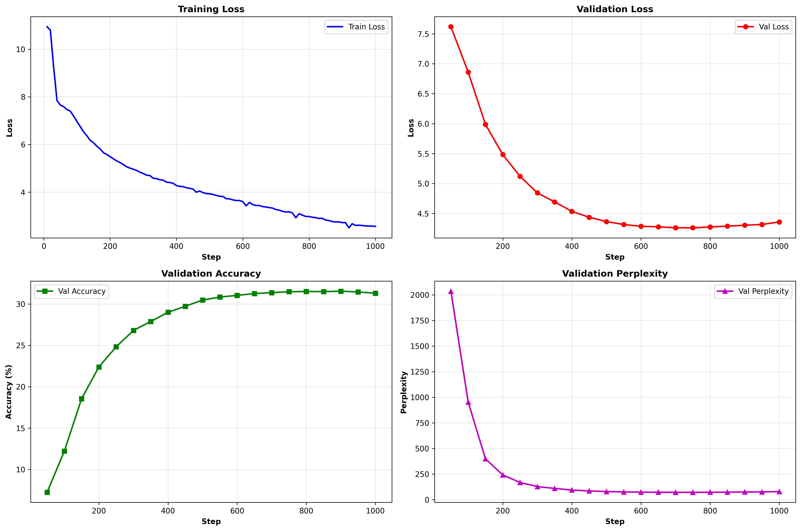

# Experiment 7: Hybrid DeltaNet + Attention Training

**Research Question:** Can combining Gated DeltaNet with standard full attention layers improve model quality while maintaining efficiency?

This experiment extends Exp6 by adding support for **hybrid architectures** that mix:
- **Gated DeltaNet layers** - Efficient linear attention with O(n) complexity
- **Standard full attention layers** - Traditional transformer attention with O(n²) complexity

## Hybrid Architecture

The model supports flexible layer configurations:

```python
# Example 1: Alternating pattern (DeltaNet, Attention, DeltaNet, ...)
config = get_hybrid_config_alternating()  # 8 layers: attn on [1, 3, 5, 7]

# Example 2: Sparse attention (mostly DeltaNet, occasional full attention)
config = get_hybrid_config_sparse_attention()  # 8 layers: attn on [3, 7]

# Example 3: Attention on final layers (DeltaNet early, attention late)
config = get_hybrid_config_attention_last()  # 8 layers: attn on [6, 7]

# Example 4: RTX 4090 optimized hybrid
config = get_hybrid_rtx4090_config()  # 12 layers: attn on [3, 7, 11]
```

## Key Features

✅ **Pure DeltaNet** - Set `attn_config=None` for baseline  
✅ **Hybrid Models** - Specify which layers use standard attention  
✅ **Sliding Window** - Configure attention window size (default: 2048)  
✅ **FLA Integration** - Uses FLA's optimized implementations for both layer types  

## Usage

### Pure DeltaNet (baseline)
```bash
python run_experiment.py --config rtx4090
```

### Hybrid Models
```python
from config import get_hybrid_rtx4090_config
config = get_hybrid_rtx4090_config()
# Train with hybrid architecture
```

## Architecture Patterns

| Pattern | Layers | Description | Use Case |
|---------|--------|-------------|----------|
| **Pure DeltaNet** | All DeltaNet | Fastest, most efficient | Long sequences, limited memory |
| **Alternating** | 50% each | Balanced hybrid | General purpose testing |
| **Sparse Attention** | 75% DeltaNet | Mostly efficient with key attention points | Production balance |
| **Attention Last** | 75% DeltaNet | Efficient early processing, quality refinement | Quality-focused |

## Research Directions

1. **Quality vs Efficiency** - Compare hybrid models against pure DeltaNet
2. **Optimal Placement** - Where should attention layers go? (early/middle/late)
3. **Attention Density** - How many attention layers needed for best results?
4. **Scaling** - How do hybrids perform at different model scales?

---

## Baseline Results (Pure DeltaNet from Exp6)

### RTX 4090 LR Ablation (200 steps)

| LR | Val Loss | Val Acc | Perplexity |
|---|---|---|---|
| 3e-4 | 7.100 | 11.2% | 1212 |
| 5e-4 | 6.354 | 16.0% | 645 |
| **1e-3** | **6.161** | **17.7%** | **474** |
| 1.5e-3 | 6.250 | 16.5% | 518 |
| 2e-3 | 6.271 | 16.8% | 529 |

**Best:** 1e-3


### Full Training (1000 steps, LR=1e-3)

**Config:** 188.98M params, batch=32, seq_len=1024, 70M tokens (no repetition)

**Results:**
- Best Val Loss: **4.253** (step 700)
- Final Val Acc: **31.20%**
- Final Perplexity: **78.38**
- Training Time: 7.21 min


