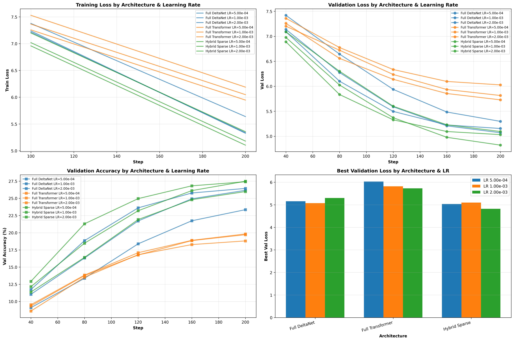
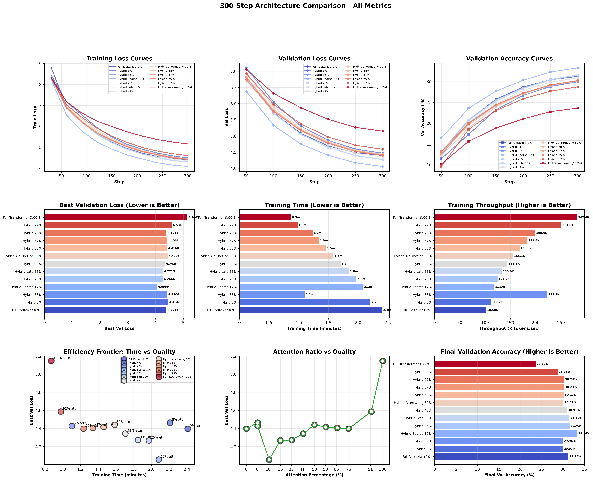

# Experiment 7: Hybrid DeltaNet Architecture Ablation (H100)

## Overview
Comprehensive ablation study testing 13 architectures across the full spectrum of DeltaNet/Attention mixtures (0% to 100% attention) to find the optimal hybrid ratio for language modeling.

---

## 🏆 Results

### Phase 1: Learning Rate Ablation (200 steps, ~9.8M tokens)


**Finding:** DeltaNet needs LR 1e-3, Hybrids/Transformer need LR 2e-3

### Phase 2: Architecture Comparison (300 steps, ~14.7M tokens)


**🥇 Winner: Hybrid Sparse 17%** (val loss: 4.055)
- 27% better than Full Transformer (worst: 5.146)
- 8% better than Full DeltaNet (5th: 4.396)
- Sweet spot: 17-33% attention (all top 3 fall here)

**Top 5 Ranking:**
1. 🥇 Hybrid Sparse 17% - 4.055
2. 🥈 Hybrid 25% - 4.266
3. 🥉 Hybrid Late 33% - 4.272
4. Hybrid 42% - 4.342
5. Full DeltaNet 0% - 4.396

**Key Insight:** Pure Transformer performed worst (13/13). Optimal balance is ~17% attention with strategic layer placement.

---

## Commands

**LR Ablation (Phase 1)**
```bash
python run_lr_ablation_h100.py
```

**Architecture Mixture Ablation (Phase 2)**
```bash
python run_full_architecture_comparison.py
```

**Train individual architecture**
```bash
python run_experiment.py --experiment h100_deltanet
python run_experiment.py --experiment h100_transformer
python run_experiment.py --experiment h100_hybrid_sparse
python run_experiment.py --experiment h100_hybrid_alternating
python run_experiment.py --experiment h100_hybrid_late
```

**Resume/extend training**
```bash
python run_experiment.py --experiment h100_deltanet --resume checkpoints_h100_deltanet/best_model.pt
python run_experiment.py --experiment h100_deltanet --resume checkpoints_h100_deltanet/best_model.pt --extend-steps 5000
```

**Compare & benchmark**
```bash
python compare_experiments.py
python ../../benchmarks/arc_challenge.py --checkpoint checkpoints_h100_deltanet/best_model.pt
```

## Architectures Tested

### Pure Architectures
- **h100_deltanet (0%)**: Pure DeltaNet - O(n) complexity
- **h100_transformer (100%)**: Pure attention - O(n²) complexity

### Hybrid Architectures (DeltaNet + Attention Mix)
- **h100_hybrid_8 (8%)**: 1/12 layers attention (last layer only)
- **h100_hybrid_sparse (17%)**: 2/12 layers attention [5, 11]
- **h100_hybrid_25 (25%)**: 3/12 layers attention [4, 8, 11]
- **h100_hybrid_late (33%)**: 4/12 layers attention [8, 9, 10, 11]
- **h100_hybrid_42 (42%)**: 5/12 layers attention [2, 4, 6, 8, 11]
- **h100_hybrid_alternating (50%)**: 6/12 layers attention (every other)
- **h100_hybrid_58 (58%)**: 7/12 layers attention
- **h100_hybrid_67 (67%)**: 8/12 layers attention
- **h100_hybrid_75 (75%)**: 9/12 layers attention
- **h100_hybrid_83 (83%)**: 10/12 layers attention
- **h100_hybrid_92 (92%)**: 11/12 layers attention (all but first)

## Model Configuration (H100)
- **Base**: 768d × 12L × 12H (~188M-302M params depending on architecture)
- **Sequence length**: 1024
- **Batch size**: 48
- **Tokens per step**: 49,152 (batch_size × seq_len)
- **Training scales**:
  - 200 steps = 9.8M tokens
  - 300 steps = 14.7M tokens
  - 700 steps = 34.4M tokens (configured)
- **Learning rates**: 
  - Pure DeltaNet: 1e-3
  - Hybrids/Transformer: 2e-3

## Key Takeaways

1. **Optimal Architecture:** Hybrid Sparse 17% (2 attention layers at positions 5, 11)
2. **Sweet Spot:** 17-33% attention (all top 3 performers fall here)
3. **Layer Placement Matters:** Strategic mid-to-late attention > early or last-layer-only attention
4. **Pure Architectures Fail:** 
   - Transformer (100% attn): WORST (ranked 13/13, 27% worse than winner)
   - DeltaNet (0% attn): Mediocre (ranked 5/13, 8% worse than winner)
5. **Learning Rates:** DeltaNet needs 1e-3, Hybrids/Transformer need 2e-3
6. **Sample Efficiency:** DeltaNet's linear recurrence provides better inductive bias than pure attention

**Recommendation:** Use Hybrid Sparse 17% with attention at layers 5 and 11 for optimal language modeling performance.

## Detailed Reports
- **Full Analysis:** [architecture_comparison_300steps/FINDINGS_REPORT.md](architecture_comparison_300steps/FINDINGS_REPORT.md)
- **Quick Summary:** [architecture_comparison_300steps/EXECUTIVE_SUMMARY.txt](architecture_comparison_300steps/EXECUTIVE_SUMMARY.txt)
